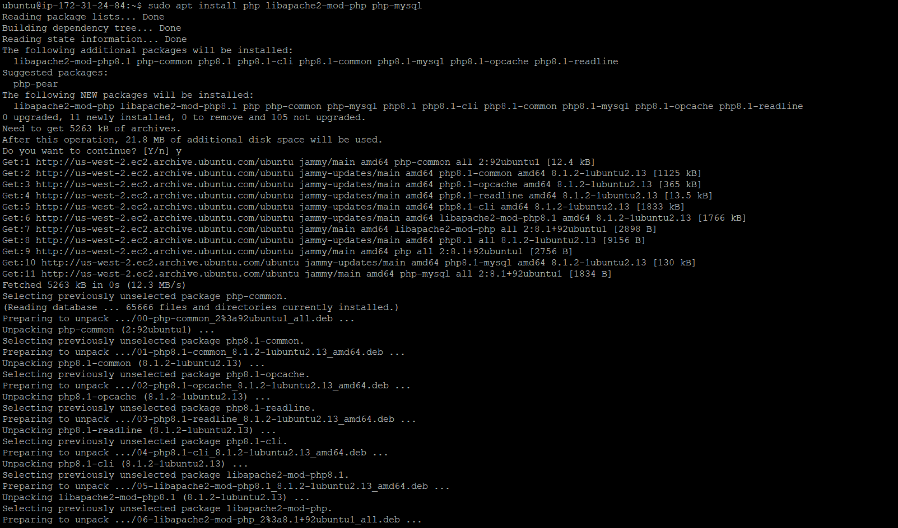

# LAMP Stack Installation

## Background
A LAMP stack is a bundle of four different software technologies that developers use to build websites and web applications.
- LAMP (Linux, Apache, MySQL, PHP or Python )

## STEP 0 : PREREQUISITE
- Launch a virtual server with Ubuntu Server OS.
- Connect to the remote host via SSH.


## STEP 1 : INSTALLING APACHE AND UPDATING THE FIREWALL (Web Server)
- Update a list of packages in package manager
`sudo apt update` 
- Run apache2 package installation
`sudo apt install apache2`
- Check Apache status
`sudo systemctl status apache2`


- Verify that apache2 is running as a Service in our OS
`sudo systemctl status apache2`
- Access url from a web browser 
`http://<Public-IP-Address>:80` or `curl -s http://169.254.169.254/latest/meta-data/public-ipv4`


## STEP 2 — INSTALLING MYSQL (Database Management System)
- To acquire and install this software
`sudo apt install mysql-server`


- Log in to the MySQL console
`sudo mysql`

`ALTER USER 'root'@'localhost' IDENTIFIED WITH mysql_native_password BY 'PassWord.1'; `

- Exit the MySQL shell with
`exit` after the mysql> prompt
- Start the interactive script by running
`sudo mysql_secure_installation`
- Test if you’re able to log in to the MySQL console
`sudo mysql -p`
- Exit the MySQL console
`exit`

## STEP 3 — INSTALLING PHP (Required Libraries and Modules for Dynamic Content)
- To install PHP package, php-mysql, libapache2-mod-php
`sudo apt install php libapache2-mod-php php-mysql`


- To confirm php version
`php -v`


## STEP 4 — CREATING A VIRTUAL HOST FOR YOUR WEBSITE USING APACHE
Virtual host allows you to have multiple websites located on a single machine.
Apache on Ubuntu 20.04 has one server block enabled by default that is configured to serve documents from the /var/www/html directory. 
- Create the directory different from the default directory
`sudo mkdir /var/www/<domain_name>`
- Assign ownership of the directory with your current system user:
` sudo chown -R $USER:$USER /var/www/<domain_name>`
- Create and open a new configuration file in Apache’s sites-available directory
`sudo vi /etc/apache2/sites-available/<domain_name>.conf`.
This will create a new blank file. Paste in the following bare-bones configuration by hitting on i on the keyboard to enter the insert mode, and paste the text:
```
<VirtualHost *:80>
    ServerName <domain_name>
    ServerAlias www.<domain_name> 
    ServerAdmin webmaster@localhost
    DocumentRoot /var/www/<domain_name>
    ErrorLog ${APACHE_LOG_DIR}/error.log
    CustomLog ${APACHE_LOG_DIR}/access.log combined
</VirtualHost>
```
- Use the ls command to show the new file in the sites-available directory
`sudo ls /etc/apache2/sites-available`
- Use a2ensite command to enable the new virtual host
`sudo a2ensite projectlamp`
- To disable Apache’s default website use:
`sudo a2dissite 000-default`
- To make sure your configuration file doesn’t contain syntax errors, run:
`sudo apache2ctl configtest`
- Reload Apache so these changes take effect:
`sudo systemctl reload apache2`
-  Create an index.html file in that location so that we can test that the virtual host works 
```
sudo echo 'Hello LAMP from hostname' $(curl -s http://169.254.169.254/latest/meta-data/public-hostname) 'with public IP' $(curl -s http://169.254.169.254/latest/meta-data/public-ipv4) > /var/www/<domain_name>/index.html
```
- Open your website URL using IP address
`http://<Public-IP-Address>:80`

## STEP 5 — ENABLE PHP ON THE WEBSITE
### Setting up index.php as landing page to take precedence over index.html
- To edit the /etc/apache2/mods-enabled/dir.conf file
`sudo vim /etc/apache2/mods-enabled/dir.conf` then type in,
```
<IfModule mod_dir.c>
        #Change this:
        #DirectoryIndex index.html index.cgi index.pl index.php index.xhtml index.htm
        #To this:
        DirectoryIndex index.php index.html index.cgi index.pl index.xhtml index.htm
</IfModule>
```
- Reload Apache so the changes take effect:
`sudo systemctl reload apache2`
### Create a PHP test script to confirm that Apache is able to handle and process requests for PHP files.
- Create a new file named index.php inside your custom web root folder:
`vim /var/www/<domain_name>/index.php`
- Type:
```
<?php
phpinfo();
```
- Refresh the page at `http://<Public-IP-Address>:80`


- Remove index.php file created (contains sensitive information about the PHP environment and server)
`sudo rm /var/www/<domain_name>/index.php`
