# WEB STACK IMPLEMENTATION (LEMP STACK)

In this project, I implemented a similar stack to LAMP, but with an alternative Web Server – NGINX, which is also very popular and widely used by many websites on the Internet.
The acronym LEMP represents Linux, eNginx, MySQL, PHP

## STEP 0 - Requirements
- An Ubuntu Virtual Machine

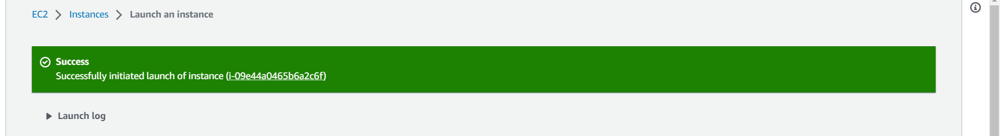
- SSH client for connecting to the VM

## STEP 1 - INSTALLING THE NGINX WEB SERVER
- Update the server package index by typing `sudo apt update`.
- Use `apt install` to get Nginx installed.
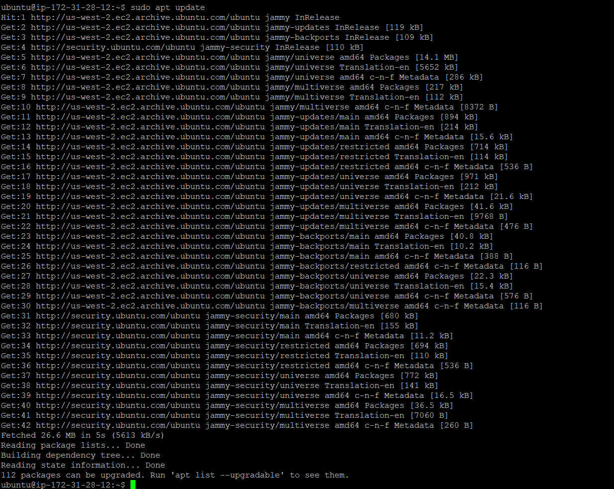

- Verify that nginx was successfully installed and is running as a service in Ubuntu `sudo systemctl status nginx`.


- To access it locally in our Ubuntu shell, run `curl http://localhost:80` or curl http://127.0.0.1:80 via a web browser.

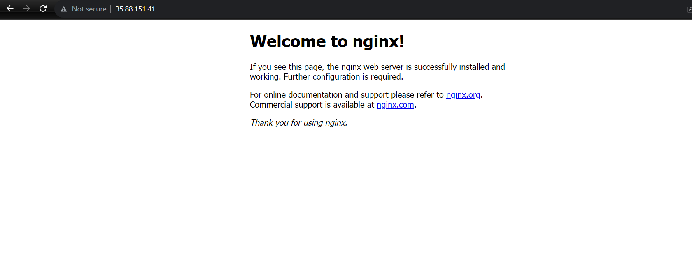

## STEP 2 — INSTALLING MYSQL  (Database Management System (DBMS) to store and manage data for your site)

- Use `sudo apt install mysql-server` to acquire and install this software.
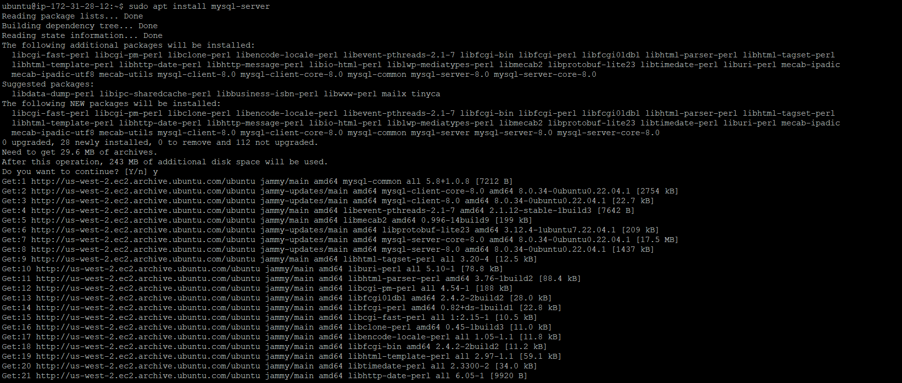


- When prompted, confirm installation by typing Y, and then ENTER.
- When done, log in to the MySQL console by typing `sudo mysql`


- Remove some insecure default settings and lock down access to your database system by typing `ALTER USER 'root'@'localhost' IDENTIFIED WITH mysql_native_password BY 'PassWord.1';`. 


- Set a password for the root user, using mysql_native_password as default authentication method `sudo mysql_secure_installation`.


- When you’re finished, test if you’re able to log in to the MySQL console by typing `sudo mysql -p`

- To exit the MySQL console, type `exit`
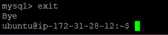
## STEP 3 – INSTALLING PHP ( To process code and generate dynamic content for the web server)

I installed php-fpm, which stands for “PHP fastCGI process manager”, which tells Nginx to pass PHP requests to this software for processing and php-mysql, a PHP module that allows PHP to communicate with MySQL-based databases.

- To install these 2 packages at once `sudo apt install php-fpm php-mysql`


- When prompted, type Y and press ENTER to confirm installation.

## STEP 4 — CONFIGURING NGINX TO USE PHP PROCESSOR

When using the Nginx web server, we can create server blocks (similar to virtual hosts in Apache) to encapsulate configuration details and host more than one domain on a single server. In this guide, we will use project LEMP as an example domain name.

- Create the root web directory for your domain as follows `sudo mkdir /var/www/projectLEMP 
- Assign ownership of the directory with the $USER environment variable `sudo chown -R $USER:$USER /var/www/projectLEMP`
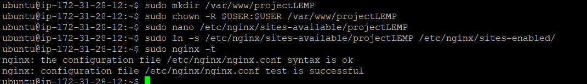


- Open a new configuration file in Nginx’s sites-available directory `sudo nano /etc/nginx/sites-available/projectLEMP` 
```
#/etc/nginx/sites-available/projectLEMP 
server {
	listen 80;
	server_name projectLEMP www.projectLEMP;
	root /var/www/projectLEMP;
 
	index index.html index.htm index.php;
 
	location / {
    	try_files $uri $uri/ =404;
	}
 
	location ~ \.php$ {
    	include snippets/fastcgi-php.conf;
    	fastcgi_pass unix:/var/run/php/php7.4-fpm.sock;
 	}
 
	location ~ /\.ht {
    	deny all;
	}
 
}
```

- Activate your configuration by linking to the config file from Nginx’s sites-enabled directory `sudo ln -s /etc/nginx/sites-available/projectLEMP /etc/nginx/sites-enabled/`
- You can test your configuration for syntax errors by typing `sudo nginx -t`


- Disable default Nginx host that is currently configured to listen on port 80, for this run: `sudo unlink /etc/nginx/sites-enabled/default`
- Reload Nginx to apply the changes: `sudo systemctl reload nginx`
- Create an index.html file under projectLEMP directory
`sudo echo 'Hello LEMP from hostname' $(curl -s http://169.254.169.254/latest/meta-data/public-hostname) 'with public IP' $(curl -s http://169.254.169.254/latest/meta-data/public-ipv4) > /var/www/projectLEMP/index.html`
- Go to your browser and try to open your website URL using IP address [http://<Public-IP-Address>:80]
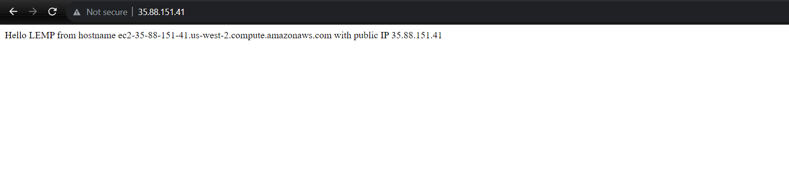

## STEP 5 – TESTING PHP WITH NGINX
Test it to validate that Nginx can correctly hand .php files off to your PHP processor.
Create a test PHP file in your document root.
- Open a new file called info.php within your document root in your text editor `sudo nano /var/www/projectLEMP/info.php`
- Type or paste the following lines into the new file.
```
<?php
phpinfo();
```
-  Access this page in your web browser by visiting the domain name or public IP address you’ve set up in your Nginx configuration file, followed by /info.php `http://`server_domain_or_IP`/info.php`

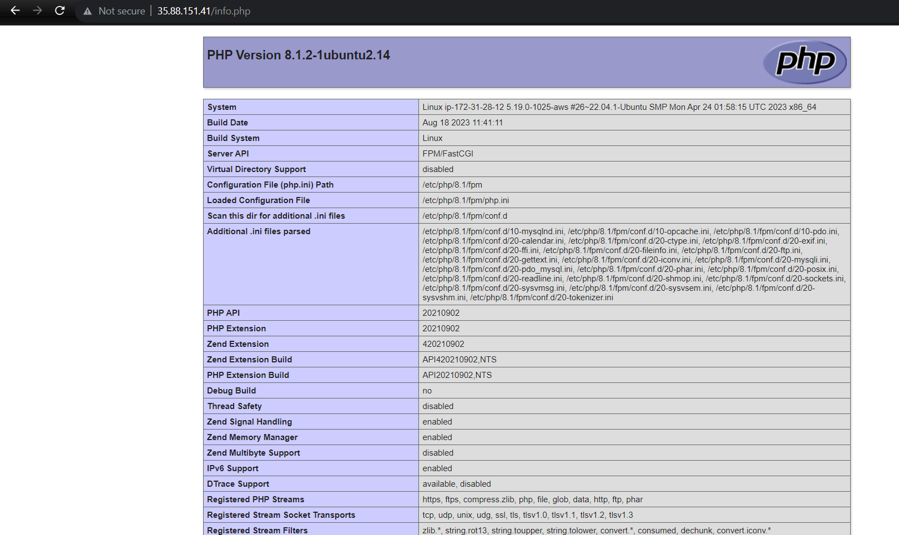
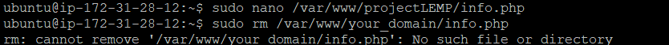
- Remove the info.php file `sudo rm /var/www/your_domain/info.php`

## STEP 6 – RETRIEVING DATA FROM MYSQL DATABASE WITH PHP
In this step I created a test database (DB) with simple "To do list" and configure access to it, so the Nginx website would be able to query data from the DB and display it.

- Connect to the MySQL console using the root account `sudo mysql -p`

- Create a new database `mysql> CREATE DATABASE `example_database`;`

- Create a new user named example_user `mysql> CREATE USER `'example_user'@'%' IDENTIFIED WITH mysql_native_password BY 'password';`


- Give this user permission over the example_database database `mysql> GRANT ALL ON example_database.* TO 'example_user'@'%';`
- Now exit the MySQL shell with `mysql> exit`
- Test if the new user has the proper permissions by logging in to the MySQL console `mysql -u example_user -p`
- Confirm that you have access to the example_database database `mysql> SHOW DATABASES;`
.png)

- Create a test table named todo_list
```
CREATE TABLE example_database.todo_list (
mysql> 	item_id INT AUTO_INCREMENT,
mysql> 	content VARCHAR(255),
mysql> 	PRIMARY KEY(item_id)
mysql> );

```

- Insert a few rows of content in the test table `mysql> INSERT INTO example_database.todo_list (content) VALUES ("My first important item");`
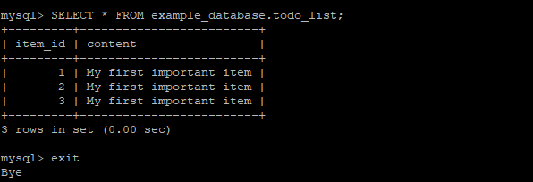


- To confirm that the data was successfully saved to your table, run: `mysql> SELECT * FROM example_database.todo_list;`
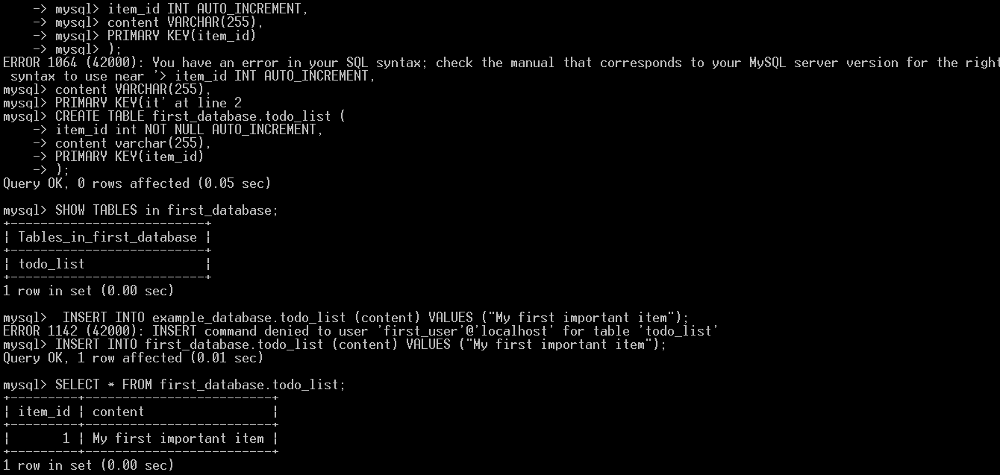

- After confirming that you have valid data in your test table, you can exit the MySQL console `mysql> exit`
- Create a PHP script that will connect to MySQL and query for your content `nano /var/www/projectLEMP/todo_list.php` and copy this content into your todo_list.php script:

```
<?php
$user = "example_user";
$password = "password";
$database = "example_database";
$table = "todo_list";
 
try {
  $db = new PDO("mysql:host=localhost;dbname=$database", $user, $password);
  echo "<h2>TODO</h2><ol>";
  foreach($db->query("SELECT content FROM $table") as $row) {
	echo "<li>" . $row['content'] . "</li>";
  }
  echo "</ol>";
} catch (PDOException $e) {
	print "Error!: " . $e->getMessage() . "<br/>";
	die();
}

```
- Save and close the file when you are done editing.
- You can now access this page in your web browser by visiting the domain name or public IP address configured for your website, followed by /todo_list.php [http://<Public_domain_or_IP>/todo_list.php]

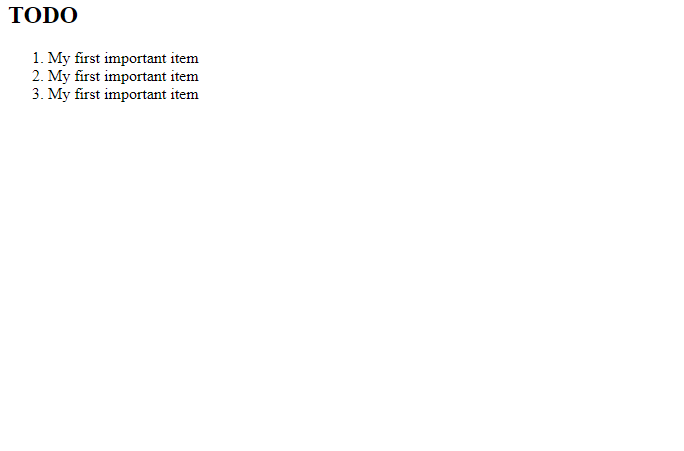